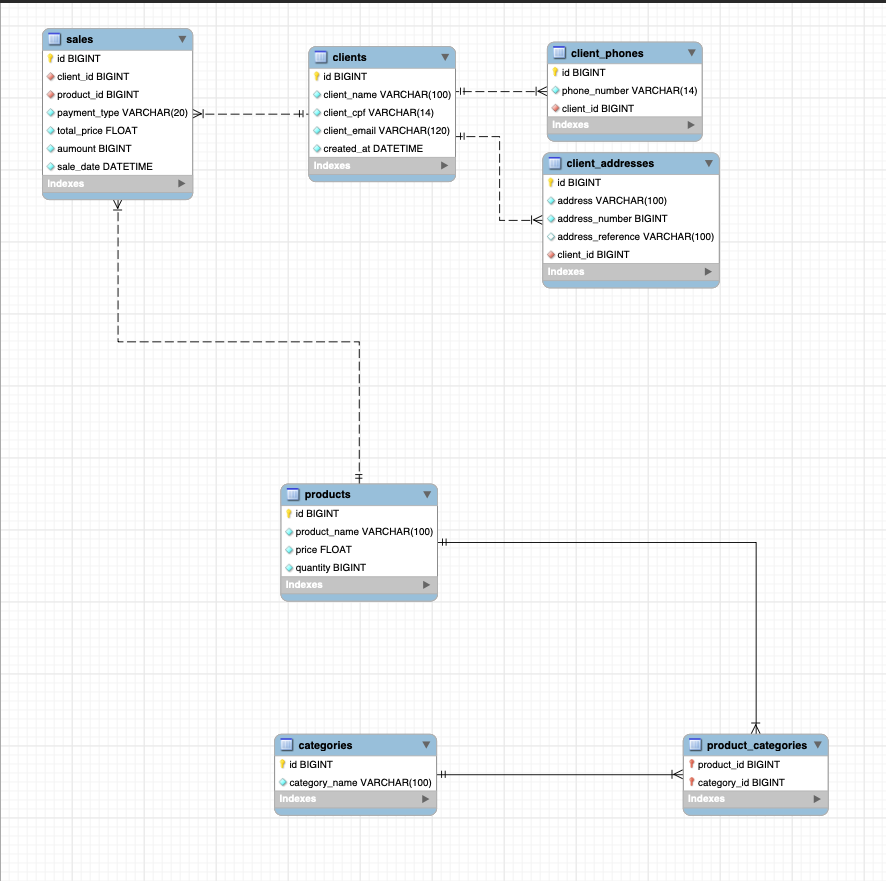

# PROJETO LOJA

- Clientes
    - Tem telefones (1:N)
    - Tem endereços (1:N)
- Produtos
    - Vários (N) possuem (N) categorias
     - produto (1, 1) -> (1, N) categoria de produtos <- (1, N) está (1:1) categoria 